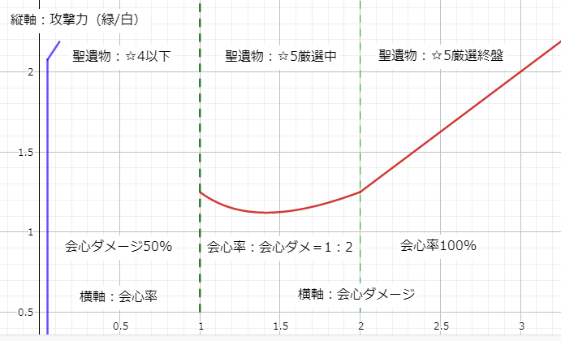
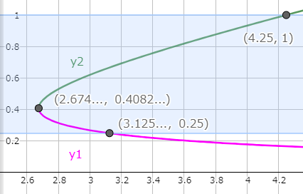
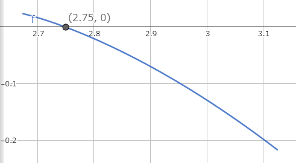
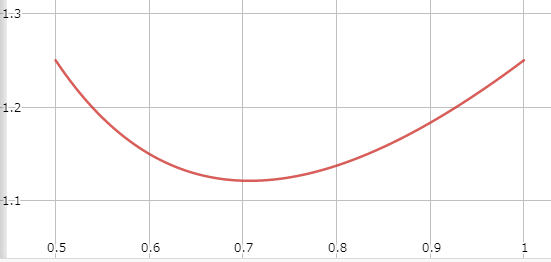
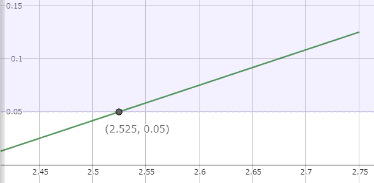
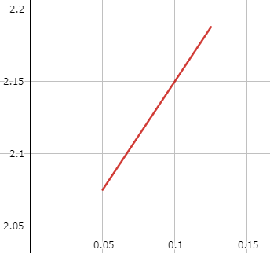
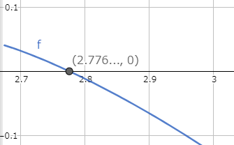
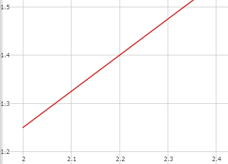

攻撃と会心の比率を数学的に表したネタ記事

## 結論

手軽に知りたい人は、ツールを作ったのでそちらを使う。

https://paimon.plus/ja/crit-ratio/

### 段階別

1. 聖遺物：★4以下  
   会心は捨てて、攻撃力を上げる
2. 聖遺物：★5厳選（初期～中盤）  
   攻撃力125%、会心率：会心ダメ＝1：2
3. 聖遺物：★5厳選（終盤）  
   攻撃力125%、会心率100%、会心ダメ200%  
   以降、攻撃力：会心ダメ＝3：4

### 詳細なグラフ

青線は、横軸が会心率  
赤線は、横軸が会心ダメージ

### Tips

あくまで理想比率なので、これらからずれても問題はない。  
また、理想比に近づけるよりも、単純に数値が高いやつの方が強いことが多い。

## 題

攻撃力と会心について、ダメージ期待値が最大になる比率を求める。

考慮すべき事項

[会心率：会心ダメ＝1：2](/gi-crit-ratio/) が最大値を取る。

★5聖遺物のサブオプションの効果量

|  |低|中|高|最高|
|-|-|-|-|-|
|攻撃力%|4.1|4.7|5.3|5.8|
|会心率|2.7|3.1|3.5|3.9|
|会心ダメ|5.4|6.2|7.0|7.8|

## 計算

攻撃力%を $x$ 、会心率を $y$ 、会心ダメージを $y′$ 、期待倍率を $z$ とする。  
また、攻撃・会心の装備スコアを $a'$ とする。

攻撃力% $x$ について、  
これはキャラクターのステータスを見たときに、攻撃力の（緑字÷白字）をした値である。  
そのため、聖遺物などで上昇する攻撃力%はこれにそのまま加算できる。

期待倍率 $z$ は
$$
\begin{align}
z&=(総攻撃力)\times((会心時のダメージ\times会心率)+(非会心時のダメージ\times非会心率))\\
&=(1+x)(((1+y')\times y)+(1\times(1-y)))
\end{align}
$$
したがって、
$$
z=(1+x)(1+yy')\tag{1}
$$

装備スコア $a'$ は
$$
\begin{align}
a'&=\frac{x}{4.7}+\frac{y}{3.1}+\frac{y'}{6.2}\\
4.7a'&=x+1.5y+\frac{1.5}{2}y'
\end{align}
$$
$a=4.7a'$ とすると、
$$
a=x+1.5y+\frac{1.5}{2}y'\tag{2}
$$

### 会心率 25% ~ 100% のとき

会心率 $y$ について、  
$0.25\le y\le 1$ のとき 会心率：会心ダメ＝1：2 が成り立つ  
このとき、$y' = 2y$ となる。  
これを $(1)$ 、$(2)$ へ代入すると、
$$
z=(1+x)(1+2y^2)\tag{3}\\
$$
$$
a=x+3y\tag{4}
$$
$(4)$ を $(3)$ へ代入し $x$ を消す。
$$
\begin{align}
z&=(1+a-3y)(1+2y^2)\\
&=-6y^3+2(a+1)y^2-3y+(a+1)\\
\frac{dz}{dy}&=-18y^2+4(a+1)y-3
\end{align}
$$
$\frac{dz}{dy}=0$ のとき
$$
\begin{align}
y&=\frac{-4(a+1)\pm\sqrt{16(a+1)^2-216}}{-36}\\
&=\frac{1}{9}(a+1\pm\sqrt{(a+1)^2-13.5})\\
&=y_1,~y_2~~~(y_1<y_2)
\end{align}
$$

### 装備スコア $a$ で場合分け

横軸を $a$ 、縦軸を $y$ としたときのグラフ

#### $0\le a\le 2.674...$ の場合
基本的に、$\frac{dz}{dy}=0$ が存在しないため、次のチャートとなる。
$$
\begin{array}{c|ccc}
y&0.25&...&1\\ \hline
\frac{dz}{dy}&...&-&...\\ \hline
z&...&\searrow&...
\end{array}
$$
したがって、$y=0.25$ のとき $z$ は最大になる。

#### $2.674...<a\le 3.125...$ の場合
$\frac{dz}{dy}=0$ となる $y$ が2つ存在し、$\frac{dz}{dy}$ が上に凸の関数であるため、次のチャートとなる。
$$
\begin{array}{c|ccccccc}
y&0.25&...&y_1&...&y_2&...&1\\ \hline
\frac{dz}{dy}&...&-&0&+&0&-&...\\ \hline
z&...&\searrow&...&\nearrow&...&\searrow&...
\end{array}
$$
したがって、$y=0.25$ または、$y=y_2$ のとき $z$ は最大になる。
$$
f(a)=z_{0.25}-z_{y_2}
$$
をグラフにすると

これより、$2.674...<a<2.75$ のとき、$y=0.25$ で $z$ は最大になる。  
また、$2.75\le a<3.125$ のとき、$y=y_2$ で $z$ は最大になる。

#### $3.125\le a\le 4.25$ の場合
$\frac{dz}{dy}=0$ となるのは、$y=y_2$ のときであるため、次のチャートとなる。
$$
\begin{array}{c|ccccc}
y&0.25&...&y_2&...&1\\ \hline
\frac{dz}{dy}&...&+&0&-&...\\ \hline
z&...&\nearrow&...&\searrow&...
\end{array}
$$
したがって、$y=y_2$ のとき $z$ は最大になる。

#### $4.25<a$ の場合
$\frac{dz}{dy}=0$ が存在しないため、次のチャートとなる。
$$
\begin{array}{c|ccc}
y&0.25&...&1\\ \hline
\dot z&...&+&...\\ \hline
z&...&\nearrow&...
\end{array}
$$
したがって、$y=1$ のとき $z$ は最大になる。

#### 会心率 25% ~ 100% のときについてまとめる
$y=0.25$ と $y=1$ のときは別に考慮することがあるため、別項にて計算する。

以上のことから、$2.75\le a\le 4.25$ のとき、$y=y_2$ で $z$ は最大になる。  
$(4)$ へ $y=y_2$ を代入すると
$$
\begin{align}
x&=a-\frac{1}{3}(a+1+\sqrt{(a+1)^2-13.5})\\
y&=\frac{1}{9}(a+1+\sqrt{(a+1)^2-13.5})\\
&(2.75\le a\le4.25)
\end{align}
$$
これをグラフにする。  
分かりやすくするため、横軸を会心率 $y$ 、縦軸を攻撃力 $x$ とする。

雑にまとめると  
会心率が50%~100%のときは  
攻撃力を125%、会心率：会心ダメ＝1：2にすれば、期待値が最も高くなる。

### 会心率 25%以下のとき
攻撃力%を $x$ 、会心率を $y$ 、会心ダメージを $y′=0.5$ 、期待倍率を $z$ とする。  
これまでの結果を参考に、$y$ と $a$ の範囲は
$$
\begin{align}
0.05&\le y<0.25\\
0&<a<2.75
\end{align}
$$
$(1)$ 、$(2)$ から期待倍率 $z$ と装備スコア $a$ は
$$
\begin{align}
z&=(1+x)(1+0.5y)\\
a&=x+1.5y+0.375
\end{align}
$$
代入して $x$ を消すと
$$
\begin{align}
z&=(1+a-1.5y-0.375)(1+0.5y)\\
&=-\frac{3}{4}y^2+\frac{1}{2}(a-2.375)y+(a+0.625)\\
\frac{dz}{dy}&=-\frac{3}{2}y+\frac{1}{2}(a-2.375)
\end{align}
$$
$\frac{dz}{dy}=0$ のとき
$$
y=\frac{1}{3}(a-2.375)=y_1
$$
横軸をa、縦軸をyとしたときのグラフ

#### $0<a\le 2.525$ の場合
基本的に、$\frac{dz}{dy}=0$ が存在しないため、次のチャートとなる。
$$
\begin{array}{c|ccc}
y&0.05&...&0.25\\ \hline
\dot z&...&-&...\\ \hline
z&...&\searrow&...
\end{array}
$$
したがって、$y=0.05$ のとき $z$ は最大になる。

#### $2.525<a<2.75$ の場合
$\frac{dz}{dy}=0$ となるのは、$y=y_1$ のときであるため、次のチャートとなる。
$$
\begin{array}{c|ccccc}
y&0.05&...&y_1&...&0.25\\ \hline
\dot z&...&+&0&-&...\\ \hline
z&...&\nearrow&...&\searrow&...
\end{array}
$$
したがって、$y=y_1$ のとき $z$ は最大になる。

これらより
$$
\begin{align}
x&=a-\frac{1}{2}(a-2.375)-0.375\\
y&=\frac{1}{3}(a-2.375)\\
&(2.525<a<2.75)
\end{align}
$$
これをグラフにする。  
分かりやすくするため、横軸を会心率 $y$ 、縦軸を攻撃力 $x$ とする。

雑にまとめると  
装備スコアが低いうちは、会心系に一切振らず  
攻撃力を200%近くまで上げたほうが、期待値が最も高い。

#### $a$ の範囲修正
会心率25%~100%の $a$ の転換点は $a=2.75$ であった。  
この時の $y$ は $y=0.25$ だったが、  
会心率25%以下の $a=2.75$ で最大になる $z$ は $y=0.125$ となった。

このことから、再度aの転換点について検証する。

会心率25%~100%の $z$ を $z′$ として、
$$
f(a)=z_{y_1}-z'_{y_2}
$$
をグラフにする。

これより、$2.525<a<2.776...$ のとき、$y=y_1$ で $z$ は最大になる。  
また、$2.776...\le a\le 4.25$ のとき、$y=y_2$ で $z′$ は最大になる。

### 会心率 100%以上のとき
攻撃力(%)をx、会心率を $y=1$ 、会心ダメージを $y′$ 、期待倍率を $z$ とする。  
これまでの結果を参考に、$y'$ と $a$ の範囲は
$$
\begin{align}
2&<y'\\
4.25&<a
\end{align}
$$
$(1)$ 、$(2)$ から期待倍率 $z$ と装備スコア $a$ は
期待倍率z、装備スコアa'は
$$
\begin{align}
z&=(1+x)(1+y')\\
a&=x+0.75y'+1.5
\end{align}
$$
代入して $x$ を消すと
$$
\begin{align}
z&=(1+a-0.75y'-1.5)(1+y')\\
&=-\frac{3}{4}y'^2+(a-1.25)y'+(a-0.5)\\
\frac{dz}{dy'}&=-\frac{3}{2}y'+(a-1.25)
\end{align}
$$
$\frac{dz}{dy'}=0$ のとき
$$
y'=\frac{2}{3}(a-1.25)=y'_1
$$
これは、$4.25<a$ のとき、常に $2<y′_1$ を満たし、次のチャートになる。
$$
\begin{array}{c|ccccc}
y'&2&...&y'_1&...\\ \hline
\dot z&...&+&0&-\\ \hline
z&...&\nearrow&...&\searrow
\end{array}
$$
したがって、$y′=y′1$ のとき $z$ は最大になる。

これらより
$$
\begin{align}
x&=a-\frac{1}{2}(a-1.25)-1.5\\
y'&=\frac{2}{3}(a-1.25)\\
&(4.25<a)
\end{align}
$$
これをグラフにする。  
分かりやすくするため、横軸を会心ダメージ $y′$ 、縦軸を攻撃力 $x$ とする。

雑にまとめると  
攻撃力125%、会心ダメージ200%  
以降は、攻撃力：会心ダメ＝3：4であげる。

### まとめ

以上、全ての会心率の範囲をまとめると次のグラフになる。  
※横軸が途中から会心ダメージになっている。

### 参考リンク
https://www.hoyolab.com/article/117691

https://www.hoyolab.com/article/144026
