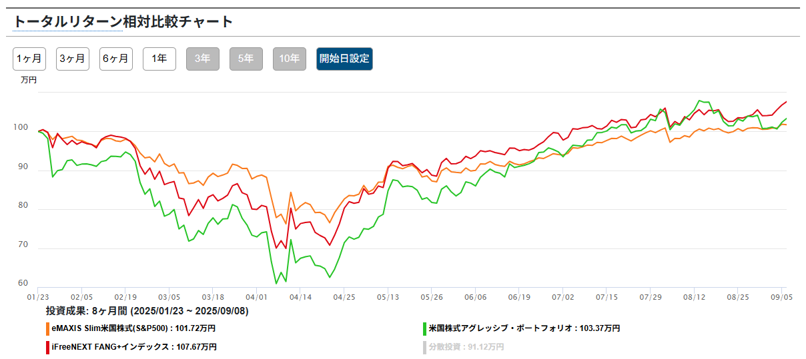
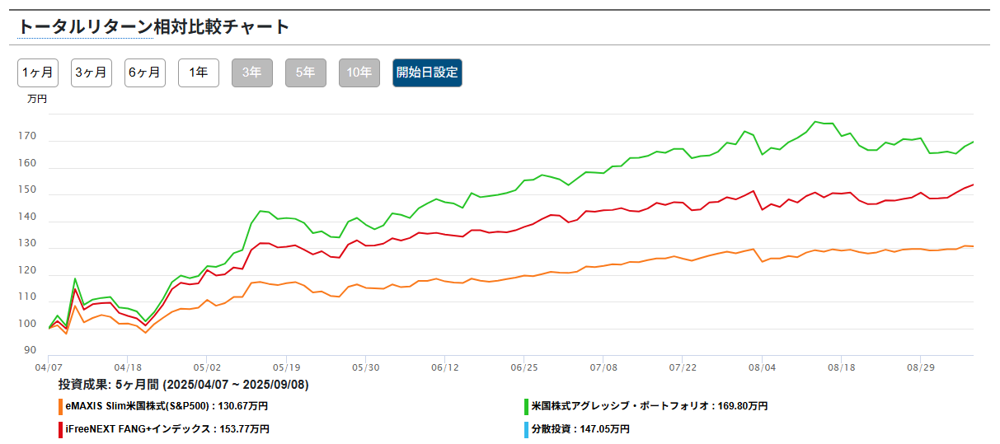
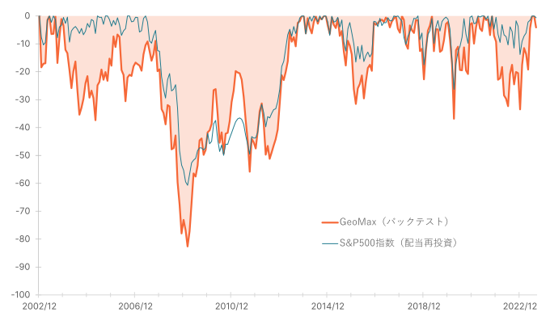

GeoMaxという投信が気になったので、Fang+と比較した簡単な調査メモ

## 結論

- 積立投資は向いてないかも
- 暴落時のスポット買いならあり

## GeoMax is 何

正式名称：[米国株式アグレッシブ・ポートフォリオ](https://geomax.funds.susten.jp/)

- 開発コンセプト
  - NISA枠を最大限有効活用
  - 個別銘柄のようなリスクリターン
- [投資戦略](https://geomax.funds.susten.jp/strategy/) v1.0
  - 米国20社
  - 均等荷重
  - ハイリスクハイリターン銘柄を選定
  - 数理モデルを用いた銘柄選定

### 投資戦略で気になる点

私の理解したv1.0の投資戦略（間違ってるかも）

$$
r_{i|adj}=β_ir_{MKT}-\frac{γ}{2}Var(i)
$$

- $r_{i|adj}$: 期待リターン
- $β_i$: 過去1年のリターンの感応度 ＝ ハイリスクハイリターンの度合い
- $r_{MKT}$: 市場平均の期待超過リターン ≒ S&P500 - 米国債券
- $\frac{γ}{2}Var(i)$: v1.0は $γ=0$ としているため無視できる項目

銘柄選定において、$r_{MKT}$ を定数とみると、$β_i$ の過去1年のハイリスクハイリターンの度合い**だけ**が選定基準になっています。

### 総経費率が高い？

1年目の経費率はこのようになってます。

- 信託報酬: 0.88%
- その他費用: 3.14%
- 合計: 4.02%

円周率じゃねぇんだぞ！ってくらい高い。

一応、その他経費は固定費で、今後資産残高が増えていけば、[総経費率は低下していく](https://note.com/susten/n/n7f1b3f39c981)とのことです。

## S&P500、Fang+、GeoMax の[比較](https://www.wealthadvisor.co.jp/comparison?c1=2018070301&c2=2018013110&c3=2023090601)

2025-01-23 ~ 2025-09-08 （トランプショック前の高値からトランプショックを抜けた後）

出典：Wealth Advisor Co., Ltd. https://www.wealthadvisor.co.jp

2025-04-07 ~ 2025-09-08 （トランプショックの安値からトランプショックを抜けた後）

出典：Wealth Advisor Co., Ltd. https://www.wealthadvisor.co.jp

チャートから分かること

- 暴落を受けても、基準価額は戻ってる
- 暴落からの上昇率は Fang+ を超える

3つの投信を比較したとき、シャープレシオは、`GeoMax < S&P500 < Fang+` となっており、GeoMax 積立投資に不向きだと考えられます。

### Fang+ との比較で気になる点

一番気になるのは、銘柄選定ルールだと思います。

- GeoMax v1.0
  - 過去1年のハイリスクハイリターンの度合い
- Fang+
  - 固定6銘柄
  - 時価総額（35％）、1日平均売買高（35％）、直近12カ月株価売上高倍率（15％）、直近12カ月株価売上高成長率（15％）
    - 変動4銘柄が上記ルールで11位以下の時入れ替え

メリットデメリットをまとめると

||GeoMax|Fang+|
|-|-|-|
|メリット|固定銘柄がなく、適切に入れ替えが起こる|複数の基準を設け、極端な選定にならない|
|デメリット|単一の基準で、極端な選定になりうる|固定銘柄のリバランスに不安|
|賛否有り|銘柄入れ替えが激しい|銘柄入れ替えが少ない|

個人的には、GeoMax と Fang+ の中間の、  
GeoMax v1.0（50％）、1日平均売買高（35％）、直近12カ月株価売上高成長率（15％）  
みたいなルールに GeoMax v2.0 でなってくれたら嬉しいなぁと思っています。

## いつ買うのか？

もし買うなら次のルールで買いたいと思います。

- 6ヶ月間の最高値から30%下回ったとき
- 安全資産の1/6を月1回購入
  - 連続時1/nとして、初月と同じ額を購入
  - 連続が途切れたら1/6から

このルールの根拠は、次のドローダウンのグラフを参考にしています。

出典：Susten Capital Management Inc. https://geomax.funds.susten.jp

- 6ヶ月30%ルールは、5年に1~2回は購入でき、経済の低迷期でも同じルールで購入できます。
- 月1回1/6購入ルールは、一度の購入額を大きくしつつ、経済低迷期にも対応できると考えたからです。

### 本当に買うのか？

- 銘柄選定基準が極端すぎる
- 新規の指標に基づく投信である

これらを加味して、上記ルールをベースに、現金の1/6で購入してみようかなと考えています。

長期的な視点としては、Fang+ と GeoMax を1:1で保有し、銘柄選定ルールを観測していれば良いのかなぁと思っています。
