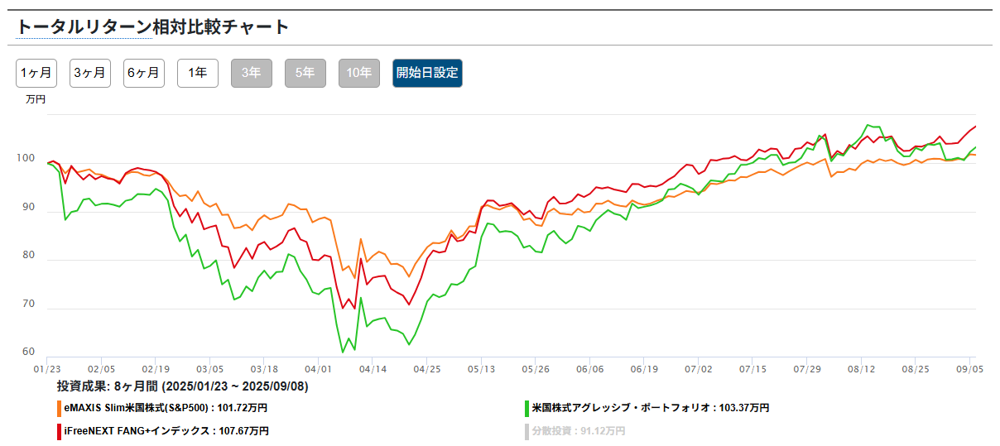
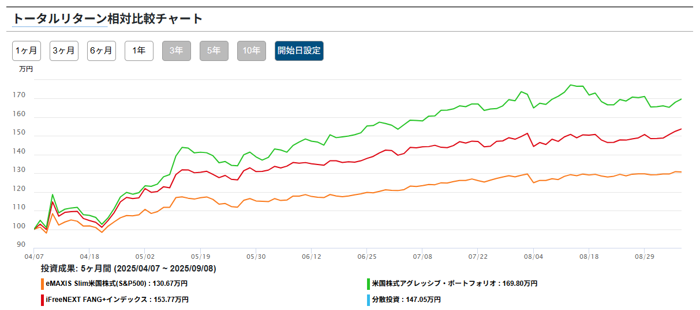
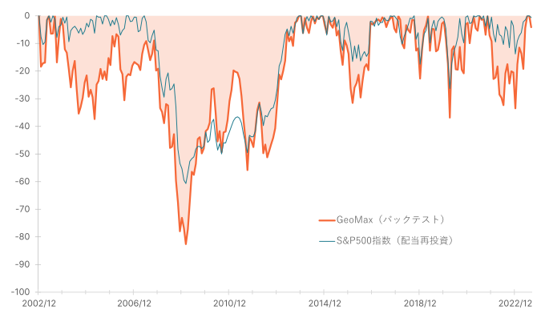

GeoMaxという投信が気になったので、Fang+と比較した簡単な調査メモ

## 結論

- 積立投資は向いてないかも
- 暴落時のスポット買いならあり

## GeoMax is 何

正式名称：[米国株式アグレッシブ・ポートフォリオ](https://geomax.funds.susten.jp/)

- 開発コンセプト
  - NISA枠を最大限活用
  - 個別銘柄のようなリスクリターンを目指す
- [投資戦略](https://geomax.funds.susten.jp/strategy/) v1.0
  - 米国20社
  - 均等荷重
  - ハイリスクハイリターン銘柄を選定
  - 数理モデルを用いた銘柄選定

### 投資戦略で気になる点

私の理解したv1.0の投資戦略

$$
r_{i|adj}=β_ir_{MKT}-\frac{γ}{2}Var(i)
$$

- $r_{i|adj}$: 期待リターン
- $β_i$: 過去1年のリターンの感応度 ≒ リスクリターンの度合い
- $r_{MKT}$: 市場平均の期待超過リターン ≒ S&P500 - 米国債券
- $\frac{γ}{2}Var(i)$: v1.0は $γ=0$ としているため無視

銘柄選定において、$β_i$ の「過去1年のリスクリターンの度合い」だけが選定基準になっています。

### 総経費率が高い？

1年目の経費率は以下の通りです。

- 信託報酬: 0.88%
- その他費用: 3.14%
- 合計: 4.02%

「円周率じゃねぇんだぞ！」ってくらい高いです。

一応、その他経費は固定費で、今後資産残高が増えていけば、[総経費率は低下していく](https://note.com/susten/n/n7f1b3f39c981)とのことです。

## S&P500、Fang+、GeoMax の[比較](https://www.wealthadvisor.co.jp/comparison?c1=2018070301&c2=2018013110&c3=2023090601)

2025-01-23 ~ 2025-09-08（トランプショック前の高値からトランプショック後まで）

出典：Wealth Advisor Co., Ltd. https://www.wealthadvisor.co.jp

2025-04-07 ~ 2025-09-08（トランプショック安値からトランプショック後まで）

出典：Wealth Advisor Co., Ltd. https://www.wealthadvisor.co.jp

チャートから読み取れること

- 暴落後も基準価額は回復している
- 暴落からの上昇率は Fang+ を上回る

3つの投信のシャープレシオを比較すると、`GeoMax < S&P500 < Fang+` となっており、GeoMax は積立投資には不向きと考えられます。

### Fang+ との比較で気になる点

一番気になるのは、銘柄選定ルールの違いです。

- GeoMax v1.0
  - 過去1年のリスクリターンの度合い
- Fang+
  - 固定6銘柄
  - 時価総額（35％）、1日平均売買高（35％）、直近12カ月株価売上高倍率（15％）、直近12カ月株価売上高成長率（15％）
    - 変動4銘柄が上記ルールで11位以下の時入れ替え

||GeoMax|Fang+|
|-|-|-|
|メリット|固定銘柄がなく、入れ替えが柔軟|複数基準で極端な選定を回避|
|デメリット|単一基準で極端な選定になりやすい|固定銘柄のリバランスに不安が残る|
|賛否両論|銘柄入れ替えが激しい|銘柄入れ替えが少ない|

## いつ買うのか？

もし購入するなら、以下のルールを想定しています。

- 6ヶ月間の最高値から30%下落したときに購入
- 安全資産の1/6を月1回購入
  - 1ヶ月後も購入条件に引っ掛かった場合は、1/nずつ購入
    - 最長の6ヶ月間で、安全資産を全てGeoMaxに回す設計
  - 下落が途切れたら再び1/6からスタート

このルールの根拠は、次のドローダウンのグラフを参考にしています。

出典：Susten Capital Management Inc. https://geomax.funds.susten.jp

- 6ヶ月30%ルールは、5年に1~2回の購入機会があり、景気低迷期にも対応可能
- 月1回1/6購入ルールは、一度の購入額を大きくしつつ、長期的な下落にも分散して対応できる

### 本当に買うのか？

- 銘柄選定基準が極端である
- 新しい指標に基づく投信である

これらを踏まえ、上記ルールをベースに現金の1/6程度で試験的に購入を検討しています。

長期的には、Fang+ と GeoMax を1:1で保有し、両者の銘柄選定ルールの動向を観察していくのが良いのではと考えています。
