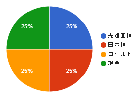

⚠️ 本記事は筆者個人の体験・考えに基づくものであり、特定の投資方法や金融商品を推奨するものではありません。投資判断はご自身の責任でお願いします。

||私について|母親について|
|:-:|:-:|:-:|
|年齢|比較的若い|定年後|
|資産|NISA枠未満|退職金がある|
|投資歴|5年|1年未満|
|その他|[ポートフォリオ](https://blog.luis.fun/inv-my-portfolio-2025/)||

こんな私が、母親のポートフォリオを考えたときのメモ

## 目標ポートフォリオ

- 1~5年目は積み立て期間
- 出口戦略は10年目以降

### リバランスルール

- 6年目以降、現金の増減時、ポートフォリオ比率を25%へ調節
- 暴落により、株式が取得金額を10%以上下回った場合、ポートフォリオ比率を25%へ調節

### 具体的な銘柄

- 先進国株：[eMAXIS Slim 先進国株式インデックス（除く日本）](https://emaxis.am.mufg.jp/fund/252653.html)
- 日本株：[eMAXIS Slim 国内株式（TOPIX）](https://emaxis.am.mufg.jp/fund/252634.html)
- ゴールド：[SBI・iシェアーズ・ゴールドファンド（為替ヘッジなし）](https://apl.wealthadvisor.jp/webasp/sbi_am/pc/basic/sa_202306080A.html)

### ポートフォリオ作成で考慮したこと

- [GPIFのポートフォリオ（年金）](https://www.gpif.go.jp/gpif/portfolio.html)を模倣
- 日本債券は過去10年でマイナスだったため、現金の方が良い
- 外国債券は為替リスクがあるため、安全資産とは言えない
- 過去20年のゴールドは株インデックスと同じくらいのリターンを出している

## GPIFのポートフォリオと異なる点

- 外国株に新興国が含まれていない
- 外国債券の代わりにゴールド
- 国内債券の代わりに現金

### 外国株に新興国株が含まれていない

これは特段理由があるわけではないです。あえて述べると、

- 新興国[含む](https://emaxis.am.mufg.jp/fund/253209.html)と新興国[含まない](https://emaxis.am.mufg.jp/fund/252653.html)を比較したとき、含まない方が直近のリターンが大きい
- ゴールドで新興国の経済成長を多少享受できると[考えている](https://blog.luis.fun/inv-my-portfolio-2025/#%E5%80%8B%E4%BA%BA%E7%9A%84%E3%81%AA%E8%80%83%E5%AF%9F%E6%96%B0%E8%88%88%E5%9B%BD%E3%81%AE%E6%88%90%E9%95%B7%E3%82%92%E4%BA%AB%E5%8F%97)

個人的には米国に期待しているため、米国比率が多少増加する新興国を含まない方を選択しました。

### 外国債券の代わりにゴールド

まず、次の点に注意してください。

- 本質的に、ゴールドは外国債券の代わりにならない
  - リスク特性が異なる
  - リターンとボラティリティが異なる

それでもGPIFと違いゴールドを選んだ理由は

- 2025年時点では、円安感があり、将来的に円高になる可能性がある
  - 円高になったとき、外国債券が為替により値下がりし、戻る見込みが不明
- 過去20年のゴールドは株インデックスと同じくらいのリターンを出している
- 株と外国債券・ゴールドの相関係数を比較すると、ゴールドの方がやや良好

各データについては、[こちら](https://myindex.jp/myaa/guest.php?cj=25&ej=25&eu=0&ed=25&ee=0&fj=0&fd=0&fe=0&rj=0&rd=0&re=0&mg=0&mo=25)を参照してください。

トータルで見た時、ゴールドも安全資産とは言い難いが、株に対して適切にリスクヘッジを取ることができ、リターンの期待感もあるため選択しました。

### 国内債券の代わりに現金

これは単純な理由です。

- 直近10年のリターンがマイナス
- プラスに転じてもリターンが小さすぎる
  - リターンが小さいと信託報酬で相殺されてしまう

やはり、国内債券を持っていてもリターンが狙えないのは、保有する理由がなくなってしまいます。また、資産の流動性の観点で、現金を常に一定額保有するのは理にかなっているためです。

それでも、何かに投資したいのであれば、個人向け国債を購入するのがいいかもしれません。

---

⚠️ 本記事は投資助言ではありません。投資判断はご自身で慎重に行ってください。
