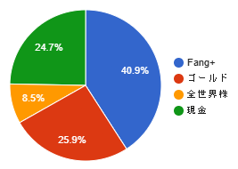

⚠️ 本記事は筆者個人の考えや体験に基づくものであり、特定の投資方法や金融商品を推奨するものではありません。投資はご自身の判断と責任で行ってください。

私について

- 年齢：比較的若い
- 資産：NISA枠が埋まらない程度
- 投資歴：5年

こんな人の個人的な投資ポートフォリオの考察メモ

## 現在のポートフォリオ

2024年11月辺りからFang+で攻める方向に変更しました。

次の配分を目標に、積立投資を行っています。

- Fang+ 60%
- ゴールド 30%
- オルカン 10%

また、暴落時にFang+をスポットで買い付ける予定です。

### リバランスルール

- 1年間のトータルリターンで、Fang+がオルカンを下回った時、Fang+をSP500とオルカンへ乗り換え（20%以上の暴落時を除外）
- Fang+のリバランス後、SP500、ゴールド、オルカンを 1:1:1 の比率になるよう調節
- 3年間のトータルリターンで、ゴールドがオルカンを下回った時、ゴールドをオルカンへ乗り換え

## Fang+を重視した理由

- アメリカの大企業に集中投資したい
- オルカンやSP500などの、インデックス投資の分散効果に疑問
- 信託報酬がeMAXIS Slimシリーズに比べて高いが、トータルリターンでカバーできる可能性が高い
- Fang+のリバランスリスクはあるが、個人のリバランスルールで回避を目指す

### アメリカの大企業に集中投資

将来性が期待できる企業に投資し、中長期のリターンを最大化したい狙いです。

※ 現在のアメリカ大企業への集中投資では、テクノロジー系に偏るリスクがあります。

### インデックス投資の分散効果に疑問

#### 分散に必要な資産数

[みずほの資料](https://www.mizuho-rt.co.jp/publication/report/2022/pdf/fe38.pdf)、ページ2「図 1 等ウェイトポートフォリオのリターンの標準偏差」のグラフを見ると、相関係数 $ρ=0.5$ 以上では、ある程度の資産数で、分散効果が頭打ちになっていることが分かると思います。

[日興AMの資料](https://www.nikkoam.com/files/market/rakuyomi/pdf/rakuyomi_vol-1933.pdf)では、2009年以降TOPIXと世界の株式市場の相関係数は、約0.5を超えています。

株式市場のインデックスに投資する場合、分散効果がそれほど期待できないことが分かります。

#### 大企業のインデックス占有率

[大和証券の資料](https://www.daiwa-am.co.jp/special/fang/index.html)には、Fang+の10銘柄で、米国市場の約25%の時価総額を持っていることが分かります。また[オルカンの目論見書](https://emaxis.am.mufg.jp/fund/253425.html)から、米国が、オルカンの64.5%を持っていることも分かります。

Fang+銘柄の占有率概算

- Fang+: 100%
- SP500: 25%
- オルカン: 16%

たった10銘柄のFang+が、これらのインデックスへ大きな影響を与えることが容易に想像できます。

#### 個人的な考察（インデックス投資の分散効果低下）

ここ数年で、インデックス投資が[増加](https://www.nikkei.com/article/DGXZQOUB231W50T21C22A2000000/)しました。この影響で、次の予測が考えられます。

1. Fang+だけが下がる（仮定）
2. SP500に1/4の影響を与える（事実）
3. 投資初心者がSP500を売却する可能性（予想）
4. SP500も下がる
5. 3へ繰り返す

もう一つ考察として、各企業の株価がインデックスに連動することが考えられます。

1. 本来であれば、各企業の業績や将来性などで株を売買
2. インデックス投資が増加（事実）
3. 各企業の株価が業績とは別で、インデックスに連動（予想）
4. 各企業の株価の相関係数が増加
5. インデックス投資としての分散効果が低下

### 信託報酬をトータルリターンでカバー
iFreeNEXT FANG+の信託報酬は0.7755%で安くはないです。しかし、SP500と比較しても3倍近いパフォーマンスを出すこともあり、最終的なトータルリターンでカバーできる範囲だと考えています。

⚠️ 過去の実績であり、将来のリターンを保証するものではありません。

### Fang+のリバランスリスク

Fang+にはリバランスに関するリスクが2つあると考えています。

- 原則組み入れる（リバランス対象外）銘柄が6つある
- Fang+へ資本が集中したとき、リバランス時に指数から乖離する

#### Fang+の原則組み入れ銘柄

- Meta Platforms
- Apple
- Amazon
- Netflix
- Microsoft
- Google

Fang+は、原則この6銘柄を組み入れることを[公表](https://www.daiwa-am.co.jp/fundletter/20221212_06.pdf)しています。これら企業の業績が悪くなったとき、適切にリバランスされるか全く分からない点がリスクだと考えています。

#### 資本集中時のリスク

執筆時点での[iFreeNEXT FANG+](https://finance.yahoo.co.jp/quote/04311181)の純資産残高は、737,952百万円ドル換算で約50億ドル。1銘柄当たり5億ドルの資産が割り当てられています。Fang+への投資信託はiFreeNEXT以外にも複数存在するため、実際には5億ドル以上の資産が1銘柄に割り当てられています。

[この資料](https://www.daiwa-am.co.jp/fundletter/20250626_02.pdf)から1日の平均売買高が比較的低い銘柄を並べると、

- [サービスナウ](https://finance.yahoo.co.jp/quote/NOW): 約20億ドル
- [クラウドストライク](https://finance.yahoo.co.jp/quote/CRWD): 約10億ドル

短期間で銘柄の乗り換えをしたとき、売りの量が株価に影響を与えるほど多くなることが予想されます。結果として、株価に影響を与えないようにリバランスできるか分からず、指数と実績が乖離する要因になると考えています。

これら2つのリスクを回避するため、個人のリバランスルールを適切に設定・運用することが非常に大事だと考えています。

## ゴールドをやや多めに組み入れる理由

ゴールドを組み込む場合、一般的に10%~15%が一つの目安とされています。  
私が目標30%を組み込む理由として、[こちらのサイト](https://myindex.jp/myaa/guest.php)で過去20年実績で米国株50%、金50%とすると、米国株only並みのリターンをより低いリスクで取ることができるシミュレーション結果が得られるからです。

⚠️ 将来性が担保されているわけではありません。

また、新興国株式インデックスの上位国であるインドと中国が、ゴールドの購入量を増加している[ニュース](https://gold.bullionvault.jp/%E3%82%B4%E3%83%BC%E3%83%AB%E3%83%89%E3%83%8B%E3%83%A5%E3%83%BC%E3%82%B9/%E4%B8%96%E7%95%8C%E3%81%AE%E5%9B%BD%E3%80%85%E3%81%AE%E9%87%91%E6%BA%96%E5%82%99%E3%81%AB%E3%81%A4%E3%81%84%E3%81%A6)があります。  
これにより間接的ですが、新興国の経済成長を多少ですが、ゴールド経由で享受することができると考えています。

## オルカンを組み入れる理由

ここまでの流れでFang+とゴールドだけでいいのでは?と思います。オルカンを組み入れる理由として
- 中長期投資の分散狙いではない
- 超長期の投資でNISAの取得基準価格を下げる狙い
- 超長期目標として、NISA積立投資枠をオルカンで埋める

Fang+とゴールドは5~10年を出口にした投資としては、悪くないラインを行けると思います。しかし、30年以上先を出口にする場合、適切ではない可能性が高いです。そのため、30年以上の超長期を想定して、オルカンを組み入れてみました。

---

⚠️ 本記事は投資助言ではありません。投資判断はご自身で慎重に行ってください。
